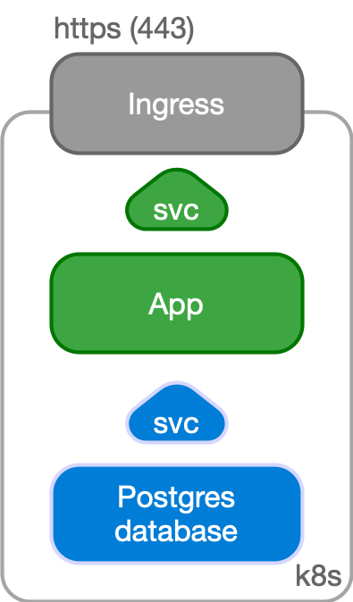
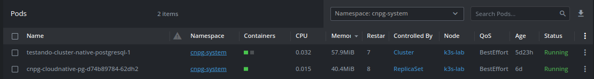
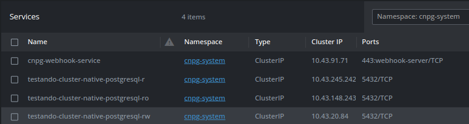
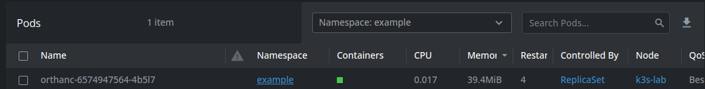
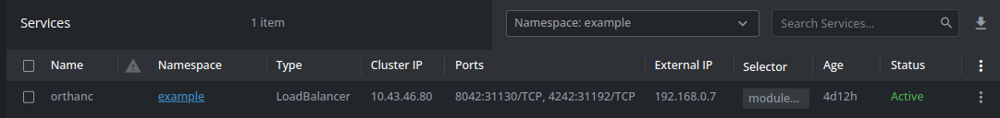
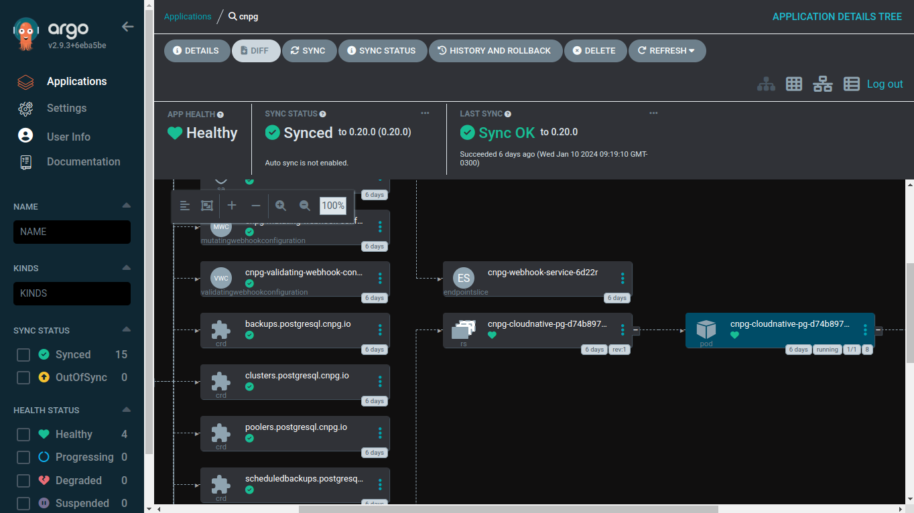
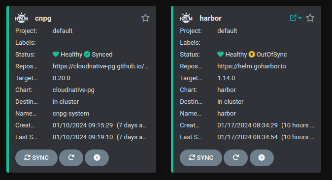
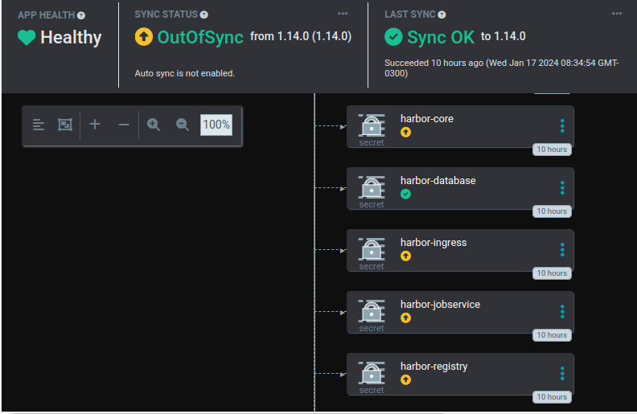
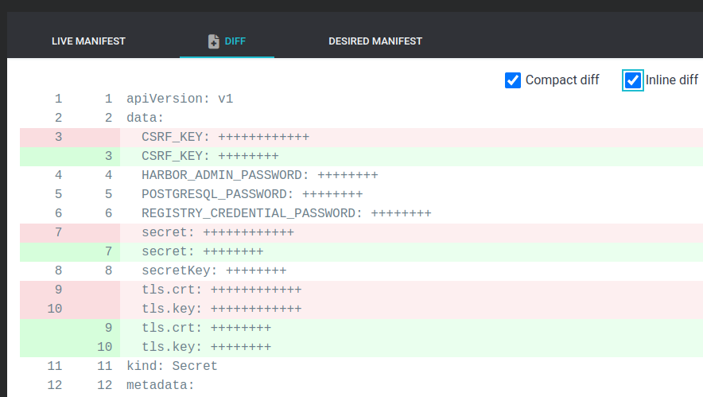

# k3s-with-ansible-poc

Este repositório trata de automatizar a implantação de um cluster K3S e suas aplicações de base em um servidor OnPremises.

## PoC do Kubernetes para Gateway

### Versão 1

#### Informações do Laboratório

Foi feita a implantação de um [k3s](https://k3s.io/) (cluster single node) em um equipamento na rede local. Foi instalado o [cilium](https://cilium.io/) como [cni driver](https://kubernetes.io/docs/concepts/extend-kubernetes/compute-storage-net/network-plugins/) padrão. A instalação do laboratório foi escrita em playbooks de [ansible](https://www.ansible.com/).

| Configuração |   |
|---|---|
| Modelo | Positivo Motion Q464B |
| Processador | Intel Atom x5 Z8350 |
| Memória RAM | 4GB DDR4 |
| Armazenamento | eMMC 64 GB |
| Sistema Operacional | Ubuntu 22.04.3 LTS |

#### Avaliar a abordagem do PostgreSQL (host ou container?)

["Nenhum dos dois"](https://www.cncf.io/blog/2023/09/29/recommended-architectures-for-postgresql-in-kubernetes/)

Sugestão: [CloudNativePG](https://cloudnative-pg.io/).

Os Pods das aplicações fariam contato internamente com o banco de dados através de um dos services disponíveis, de acordo com a necessidade, usando um dos dns internos do kubernetes para o cluster postgreSQL mantido pelo operador CNPG.

Exemplos:

- `testando-cluster-native-postgres-r.cnpg-system.svc.cluster.local:5432` (_read-only_, ler de qualquer instância)
- `testando-cluster-native-postgres-rw.cnpg-system.svc.cluster.local:5432` (_read and write_, ler/escrever na instância principal)
- `testando-cluster-native-postgres-ro.cnpg-system.svc.cluster.local:5432` (_replicas only_, ler apenas das réplicas)



<br>



<br>



<br>

Usar o CNPG nos possibilita configurar backups manuais [da seguinte maneira](https://blog.palark.com/cloudnativepg-and-other-kubernetes-operators-for-postgresql/):

```yaml
backup:
  retentionPolicy: "30d" # Período de retenção do Arquivo
  barmanObjectStore:
    destinationPath: "s3://backup/backups" # Caminho para o diretório
    endpointURL: "https://s3.storage.foo.bar" # Endpoint para um serviço de S3
    s3Credentials: #  Credenciais para acessar o bucket
      accessKeyId:
        name: s3-creds
        key: accessKeyId
      secretAccessKey:
        name: s3-creds
        key: secretAccessKey
    wal:
      compression: gzip # Compressão WAL habilitada
```

Agendando a realização dos backups:

```yaml
---
apiVersion: postgresql.cnpg.io/v1
kind: ScheduledBackup
metadata:
  name: testando-cluster-native-postgres-backup
spec:
  immediate: true
  schedule: "0 0 0 * * *" # A notação de agendamento tem 6 dígitos, que incluem segundos
  cluster:
    name: testando-cluster-native-postgres
```

---

<br>

#### Orthanc principal. Deve ter porta 4242 acessível na rede local, mantendo IP de origem sem mascarar; usar MetalLB?

Foi feito um deploy de um orthanc principal (docker.io/jodogne/orthanc:latest) com um `service` do tipo `LoadBalancer` nas portas `4242` e `8042`. Ele foi acessado na interface gráfica, e foi feito um curl pra ele no endereço de ip do servidor do k3s-lab, na porta `4242`. Para esta prova de conceito é viável fazer a externalização do orthanc via `LoadBalancer`. No entanto, seria recomendado utilizar um `Ingress Controller` para gerenciar um único ponto de contato ao cluster utilizando `Ingress Routes`. O K3S utiliza o [Traefik proxy](https://traefik.io/) como `Ingress Controller` padrão. Também podemos avaliar a adoção de um [API Gateway](https://kubernetes.io/docs/concepts/services-networking/gateway/), sendo este último uma abordagem nova e alternativa que substituirá futuramente o uso de `Ingress Controller`.

<br>



<br>



<br>

---

#### ArgoCD

Foi implantado um ArgoCD via playbook de ansible, para que seja verificada a utilização dele para a implantação de demais aplicações usando helm ou manifestos kubernetes seguindo a abordagem GitOps.



É possível ver informações gerais e debugar as aplicações que foram instaladas pelo argoCD, seja como helm, kustomize ou manifestos em um repositório git.



Na imagem abaixo, o argoCD informa quais objetos da aplicação em questão estão fora de sincronia com o que está declarado no Helm que foi instalado.



É possível ver a diferença entre o estado desejado e o estado atual dos recursos dentro do cluster.


